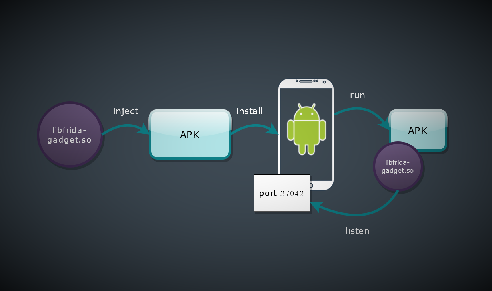

# Inject Frida's *Gadget* under Android: Not rooted device

- Ref: [Frida's Gadget Injection on Android: No Root, 2 Methods - Alexandr Fadeev](https://fadeevab.com/frida-gadget-injection-on-android-no-root-2-methods/)



You have 2 options to inject Frida's Gadget to Android application: 

1. **Method 1**: If targeted APK contains any native library (`<apk>/lib/arm64-v8a/libfromapk.so`), then you can inject libfrida-gadget.so as a dependency into the native library.

2. **Method 2**: If APK doesn't contain a native library, then you can inject `System.loadLibrary` bytecode.

        Only method 1 will be used here

## Method 1 : Inject a `libfrida-gadget.so` as a dependency to a native library (JNI) inside of APK

The used APK coming from github project [cdroid](https://github.com/Wirtos/cdroid.git) where 2 APK were generated : 
- first with "android.permission.INTERNET"
- second without this permission.

Basically, you need this article: [How to use frida on a non-rooted device - LIEF](https://lief.quarkslab.com/doc/stable/tutorials/09_frida_lief.html).

1. Download and unpack frida-gadget >= 12.8.8 for Android for arm64 

!!! les versions 12.7.0 à 12.8.7 ne parviennet pas à contacter le serveur [Issue#286](https://github.com/frida/frida-core/issues/286).

```shell
$ wget https://github.com/frida/frida/releases/download/16.1.4/frida-gadget-16.1.4-android-arm64.so.xz
$ unxz -d frida-gadget-16.1.4-android-arm64.so.xz
```

2. *Unpack* APK

```shell
$ apktool d -rs <target>.apk
```

- Use apktool >= 2.4.1.
- `-rs` is to not decode resources and sources, it will save you time and keep your nerves while compiling the APK back.
- **unzip/zip** doesn't always work - application may not bring up.

3. Copy frida-gadget to the unpacked APK directory.

```shell
$ cp frida-gadget-16.1.4-android-arm64.so target/lib/arm64-v8a/libfrida-gadget.so
```

4. Patch library with the following script

```python
#!/usr/bin/env python3

import lief

libnative = lief.parse("target/lib/arm64-v8a/libfromapk.so")
libnative.add_library("libfrida-gadget.so") # Injection!
libnative.write("target/lib/arm64-v8a/libfromapk.so")
```

5. Check the injection succeeded.

```shell
$ readelf -d target/lib/arm64-v8a/libfromapk.so

Dynamic section at offset 0xb2220 contains 30 entries:
  Tag        Type                         Name/Value
 0x0000000000000001 (NEEDED)             Shared library: [libfrida-gadget.so]
...
```

6. Re-pack APK.

```shell
apktool b <target>
```

&. Sign APK

 used "Uber APK signer": [uber-apk-signer](https://github.com/patrickfav/uber-apk-signer)

```shell
$ java -jar uber-apk-signer-1.1.0.jar -a ./target/dist/target.apk
```

5. Install l'APK

```shell
$ adb install -r -g <apk_file>.apk
```

## Check *frida-gadget* 

1. Print log 

```shell
$ adb logcat | grep -i frida
XX-XX XX:XX:XX.XXX 17595 17618 I Frida   : Listening on 127.0.0.1 TCP port 27042
```

2. Check openning port

```shell
$ adb shell netstat -ln | grep 27042
tcp        0      0 127.0.0.1:27042         0.0.0.0:*               LISTEN
```


